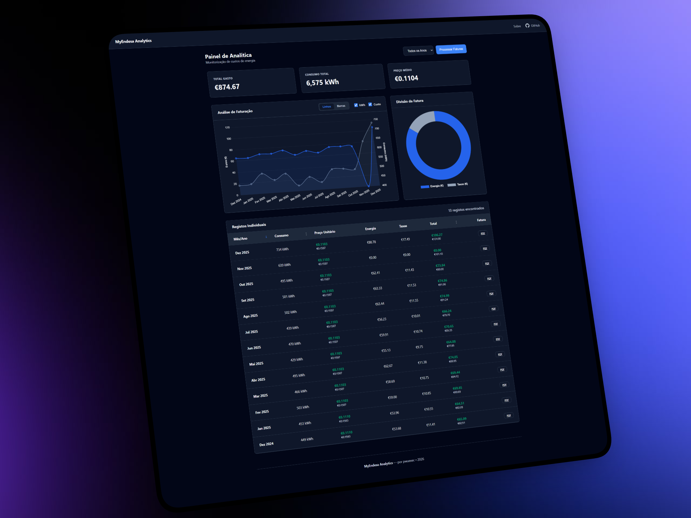

# Hautom - Extrator de Faturas Endesa

O Hautom é uma ferramenta de código aberto desenvolvida para extrair dados de faturas de eletricidade da **Endesa**. O projeto foca-se na transparência, permitindo validar se os descontos e tarifas aplicados refletem a poupança real, sem o ruído das comunicações de marketing.

## Funcionalidades

* **Extração Direta:** Captura de consumo (kWh), períodos, valores totais e descontos aplicados (incluindo Tarifa Social e meses de oferta).
* **Prevenção de Duplicados:** Identifica ficheiros já processados através de assinatura digital (hash).
* **Armazenamento:** Histórico centralizado em base de dados local para análise da evolução de custos.

## Limitações e Notas

* **Exclusividade:** Desenvolvido especificamente para faturas da **Endesa**.
* **Simplicidade:** Suporta apenas tarifários simples (não compatível com bi-horário ou tri-horário).
* **Privacidade:** Processamento local para garantir que os dados de consumo permanecem privados.

## Utilização

1. Coloque as faturas em formato PDF na pasta configurada.
2. Execute a aplicação.
3. Os dados são extraídos, validados e guardados automaticamente na base de dados.